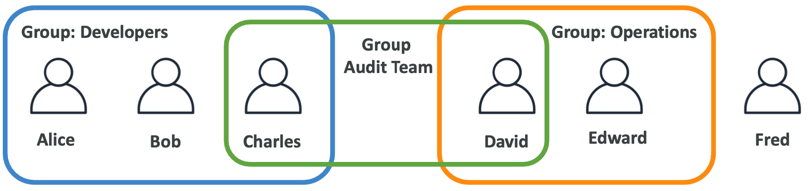
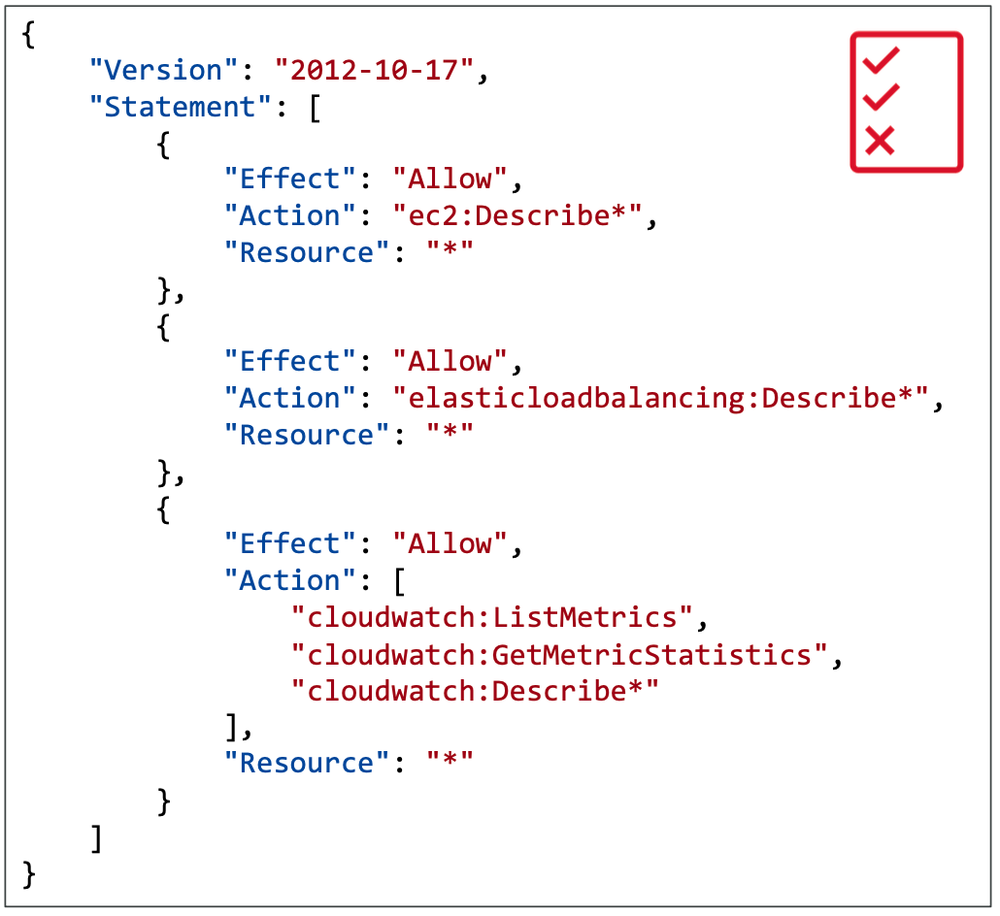
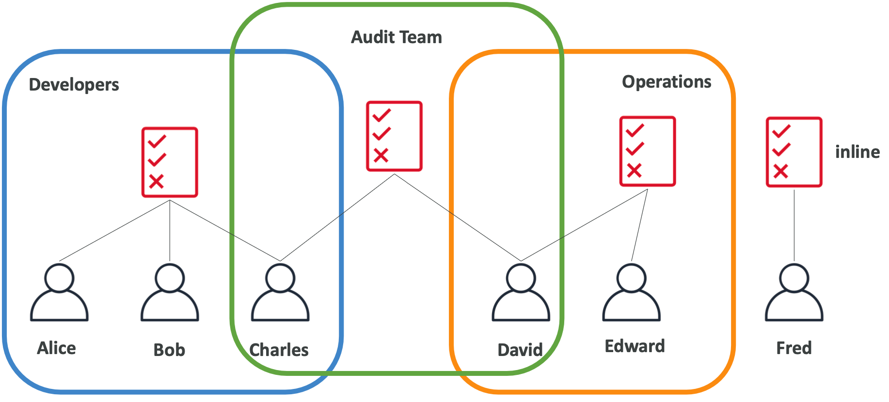
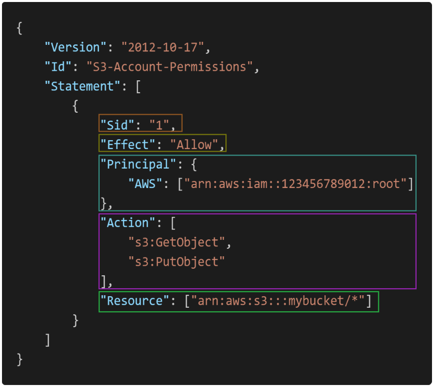
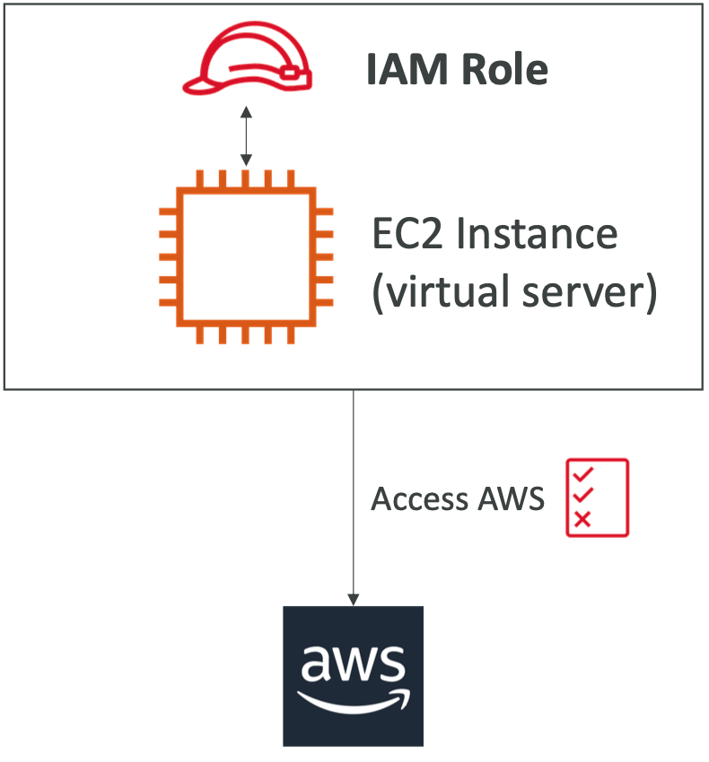

- [**AWS Cloud Use Cases**](#aws-cloud-use-cases)
- [**AWS Global Infrastructure**](#aws-global-infrastructure)
- [**AWS Regions**](#aws-regions)
- [**How to choose an AWS Region ?**](#how-to-choose-an-aws-region-)
- [**AWS Availability Zones**](#aws-availability-zones)
- [**Tour of the AWS Console**](#tour-of-the-aws-console)

## **AWS Cloud Use Cases**

- AWS enables you to build sophisticated, scalable applications
- Applicable to a diverse set of industries
- Use cases include
  - Enterprise IT, Backup & Storage, Big Data analytics
  - Website hosting, Mobile & Social Apps
  - Gaming
 
## **AWS Global Infrastructure**

- AWS Regions
- AWS Availability Zones
- AWS Data Centers
- AWS Edge Locations/Points of Presence
- https://infrastructure.aws/

<!--  -->

## **AWS Regions**

- AWS has regions all around the world
- Names can be us-east-1, eu-west-3...
- A region is a cluster of data centers
- Most AWS services are region scoped(if you use the same service in two different regions, you will be charged twice)

## **How to choose an AWS Region ?**

If you need to launch a new application, where should you do it? 

- [Compliance]() with data governance and legal requirements: data never leaves a region without your explicit permission
- [Proximity]() to customers: reduced latency
- [Available services]() within a Region: new services
and new features aren’t available in every Region
- [Pricing:]() pricing varies region to region and is transparent in the service pricing page.

## **AWS Availability Zones**

- Each region has many availablility zones(usually 3, min is 3, max is 6). Example:
  - ap-southeast-2a
  - ap-southeast-2b
  - ap-southeast-2c

- Each availability zone(AZ is one or more discrete data centers with redundanct power, networking, and connectivity)
- They're separate from each other,so that the're isolated from disasters
- They're connected with high bandwidth, ultra-low latency networking
  
  

## **Tour of the AWS Console**

- **AWS had Global Services:** 
  - Identity and Access Management (IAM)
  - Route 53 (DNS Service)
  - CloudFront (Content Delivery Network)
  - WAF (Web Application Firewall)

- **Most AWS services are Region-scoped:**  

  - Amazon EC2 (IAAS)
  - Elastic Beanstalk (PAAS)
  - Lambda (Function as a Service)
  - Rekognition (Software as a Service)

- **Region Table:** https://aws.amazon.com/about-aws/global-infrastructure/regional-product-services

# [IAM Section](IAM.md)
 
## **IAM: Users & Groups**

- IAM = Identity and Access Management, Global service
- Root account created by default, shouldn't be used or shared
- Users are people within your organization, and can be grouped
- Groups only contain users, not other groups
- Users don't have to belong to a group, and user can belong to multiple groups

  

## **IAM: Permissions**

- Users or Groups: can be assigned JSON documents called policies

- These policies define the permissions of the users

- In AWS you apply the least privilege principle: don't give more  permissions than a user needs

  

## **IAM Policies Inheritance**

## **IAM Policies Structure**

- Consists of
  - Version:policylanguageversion,alwaysinclude“2012-10- 17”
  - Id:anidentifierforthepolicy(optional)
  - Statement:oneormoreindividualstatements(required)

- Statements consists of
  - Sid: an identifier for the statement(optional)
  - Effect: whether the statement allows or denies access (Allow, Deny)
  - Principal: account/user/role to which this policy applied to
  - Action: list of actions this policy allows or denies
  - Resource: list of resources to which the actions applied to
  - Condition: conditions for when this policy is in effect (optional)

## **IAM Roles for Services**

- Some AWS service will need to perform actions on your behalf
- To do so, we will assign permissions to AWS services with IAM Roles
- Common roles:
  - EC2 Instance Roles
  - Lambda Function Roles
  - Roles for CloudFormation

  

## **IAM Security Tools**

- **IAM Credentials Report (account-level)**
  - a report that lists all your account's users and the status of their various credemtials
 
   

- **IAM Access Advisor (user-level)**
  - Access advisor shows the service permissions granted to a user and when those services were last accessed.
  - You can use this information to revise your policies.